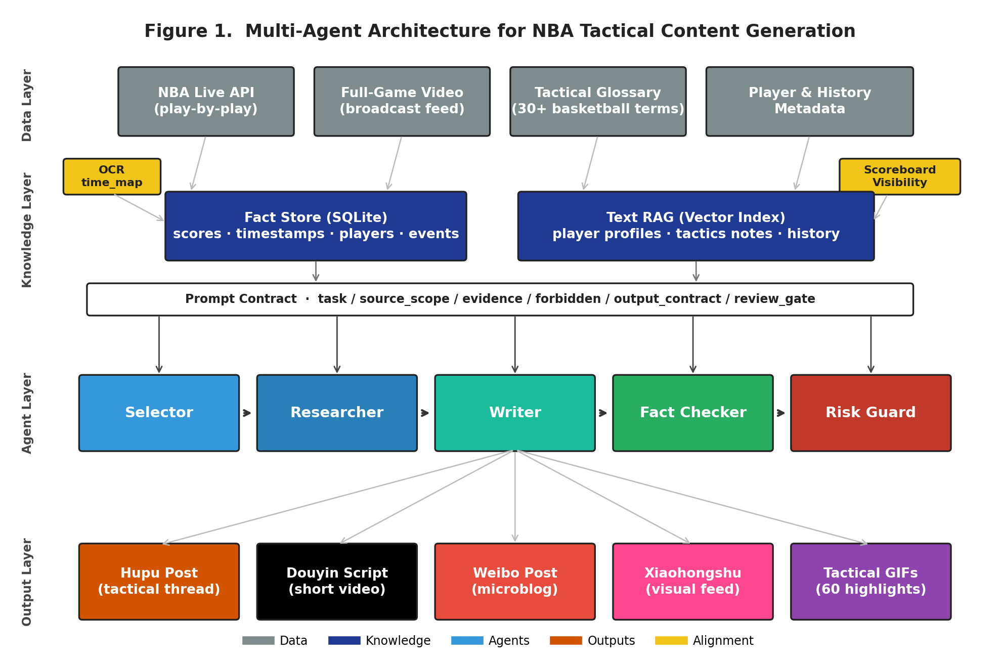
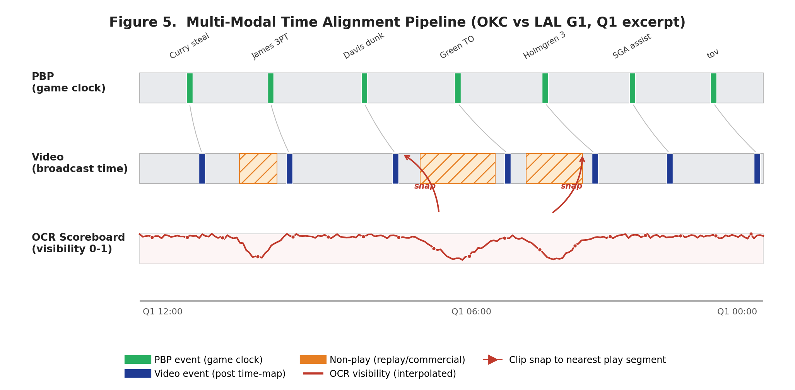
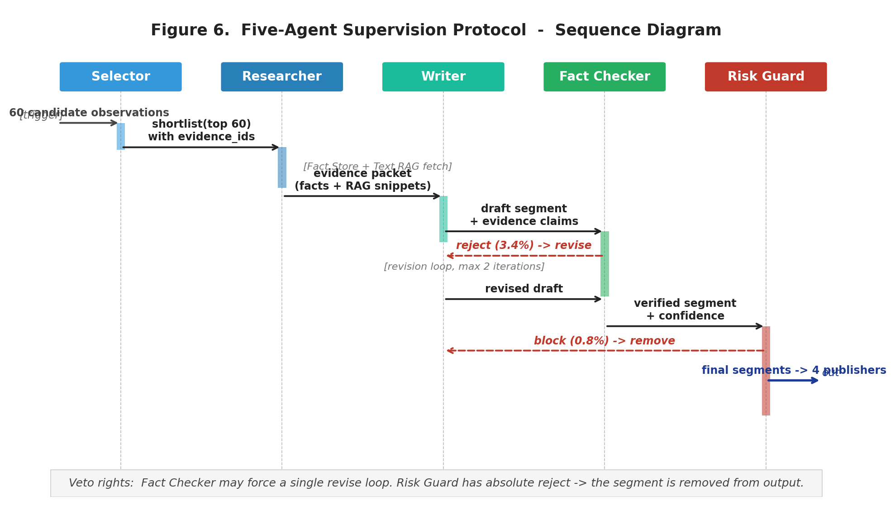
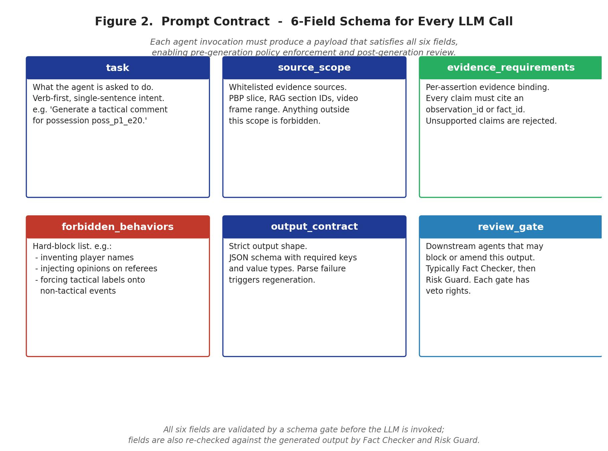

# 第 3 章 系统设计

本章介绍本研究提出的"多模态多智能体 NBA 战术内容生成系统"的整体架构与各核心模块的设计原则。3.1 节给出系统的四层架构总览；3.2 节介绍数据层与多模态对齐机制；3.3 节介绍双层知识架构；3.4 节介绍 5-Agent 监督协议；3.5 节介绍提示契约（Prompt Contract）的形式化定义；3.6 节介绍可视化事实溯源机制；3.7 节介绍输出层与多平台风格化设计。

## 3.1 总体架构

本系统采用四层分层架构：**数据层（Data Layer）→ 知识层（Knowledge Layer）→ 智能体层（Agent Layer）→ 输出层（Output Layer）**。各层之间通过明确的接口契约通信，每一层的实现可以独立替换。系统总体架构如图 3-1 所示。

四层架构的设计原则如下：

- **数据层（Data Layer）**：负责从外部接入原始数据。当前实现包括 NBA Live API 拉取 play-by-play 数据、本地全场录像视频文件、内置的战术术语库（30+ 篮球术语中英对照表）以及球员历史档案。视频侧通过 OCR 时间映射与记分牌可见性检测两个辅助模块，向上层提供"播放段—非播放段"二分类信号与"视频秒数 ↔ 比赛时钟"映射函数。
- **知识层（Knowledge Layer）**：将数据层提供的原始信息整理为可被智能体高效检索的两类知识载体——结构化 Fact Store（SQLite）与叙事 Text RAG（向量索引）。两类知识由不同的查询接口提供服务，并由路由规则决定每类断言应优先查询哪一层。
- **智能体层（Agent Layer）**：五个角色（Selector、Researcher、Writer、Fact Checker、Risk Guard）按流水线方式协同推进。每个角色的输入、输出、可用工具、可访问的知识源均由 Prompt Contract 显式约束。
- **输出层（Output Layer）**：将智能体层产出的最终内容打包为面向四个目标平台（虎扑、抖音、微博、小红书）的差异化稿件，以及 60 个关键回合的战术 GIF 集合。

### 3.1.1 系统设计原则

本系统在架构设计时遵循以下五个核心原则：

1. **关注点分离（Separation of Concerns）**：每一层、每一个角色只关心自己的子任务，跨层与跨角色的耦合通过显式接口契约实现。这一原则保证了系统的可维护性与可扩展性。
2. **证据可追溯（Provenance-Aware）**：从数据层到输出层，每一条生成内容必须能够追溯到具体的原始数据源。Fact Store 中的每条记录有唯一 ID；Text RAG 中的每段文本有 chunk_id；Writer 生成的每个 segment 必须在 evidence 字段中列出所用的 ID。
3. **硬监督优先（Hard Supervision Over Soft Suggestions）**：所有评审角色（Fact Checker、Risk Guard）的判定结果对下游具有阻塞权而非建议权。校验失败的内容必须被修正或剔除，不允许"带病过关"。
4. **领域感知（Domain-Awareness）**：所有 prompt 中显式注入篮球领域知识，包括术语库、典型战术名称、负面规则（"不强行套战术名"等）。这一原则使本系统区别于通用对话式 LLM 应用。
5. **人机协同（Human-in-the-Loop）**：系统不寻求完全替代人力编辑，而是在最终发布前提供"网页评审界面"让编辑做人工筛选与最终把关。AI 负责"找证据、排版、初稿"，人负责"判断与署名"。

### 3.1.2 端到端流水线时序

一次完整的端到端运行包含以下步骤：

1. **触发**：用户在 Web 控制台选择一场已结束的 NBA 比赛（通过 game picker 从近 30 天的赛程中选择），或系统在比赛结束后由调度器自动触发。
2. **PBP 接入**：调用 NBA Live API 拉取 game_id 对应的完整 play-by-play 数据（约 500-700 个事件）。
3. **观察构建**：由规则引擎从 PBP 中筛选出"具有内容价值的回合"约 60 个，输出 60 个 observation，每个 observation 包含 possession_id、时间码、事件描述、参与球员、初步战术标签。
4. **多模态对齐**：基于 OCR 时间映射和记分牌可见性检测，将每个 observation 的时间码映射到真实视频秒数；对落在非播放段的回合执行 snap 操作。
5. **片段提取**：使用 ffmpeg 按对齐后的时间窗口切取 60 个视频片段，每个 8-12 秒。
6. **智能体协同**：5 角色按流水线推进——Selector 复核 60 个 observation；Researcher 为每个 observation 从 Fact Store + Text RAG 检索证据；Writer 生成战术解说；Fact Checker 校验每个断言；Risk Guard 检查风险；最终输出 60 个 key_segments 字段完整的报告。
7. **多平台打包**：social_packager 模块基于 key_segments 与 GIF 文件，为虎扑、抖音、微博、小红书各生成一个 package.json + Markdown 草稿。
8. **网页评审**：用户在 tactical_review.html 页面查看 60 个回合的 GIF + 战术解说 + 质量打分，通过勾选筛选最终交付的回合，一键导出虎扑发帖草稿。

整个流水线在 OKC vs LAL G1（约 2.5 小时全场录像）上端到端运行时间约 80-90 分钟，其中视频处理（OCR + 可见性检测 + 片段切取）占 60-70 分钟，LLM 调用占 5-10 分钟，其他模块（PBP 接入、社交打包、网页渲染）占 5-10 分钟。

## 3.2 数据层与多模态时间对齐

数据层承担从外部接入原始多模态数据，并将其规范化为上层可用的形式。本节重点介绍其中最具技术挑战性的多模态时间对齐子模块。

### 3.2.1 体育视频对齐的特殊难题

NBA 比赛全场录像与 PBP 数据之间的时间对齐看似简单，实际却存在两个核心难题：

- **比赛时钟 vs 录像时钟的非线性关系**：理论上，比赛进行了 N 秒应该对应录像中相同的 N 秒前进；但实际上，由于回放、慢镜头、特写、广告、暂停等"非比赛画面"穿插，录像中的"播放段"与"非播放段"以高频交替出现。据本研究的统计，标准的 NBA 比赛全场录像约有 40% 的时长是非比赛画面。
- **节末 / 半场 / 暂停的不连续性**：在节末（Q1-Q2 间、Q2-Q3 间即半场、Q3-Q4 间）会出现长达数分钟的暂停，加上比赛中频繁的 timeout（每节最多 7 次），导致"比赛时钟到录像时钟"的映射函数严重不连续。

传统线性映射方案（假设每节用相等的录像时长容纳）在节内或许还能凑合，但跨节几乎必然失败。

### 3.2.2 三步走对齐方案

本研究提出"OCR 时间映射 + 记分牌可见性检测 + 播放段对齐"三步走方案。该方案的核心思想如图 3-2 所示。

具体步骤如下：

**步骤 1：OCR 时间映射。** 在视频每秒采样一帧（通过 ffmpeg 的 `-vf fps=1` 滤镜流水线获取，速度远快于 cv2 随机定位），对预先标定的"记分牌 ROI 区域"做 OCR（基于 EasyOCR），抽取出"节次（1-4）+ 剩余比赛时钟（MM:SS）"。在 OKC vs LAL G1 上，2.5 小时（约 9000 秒）的视频共获得约 95 个有效 OCR 样本——其余被识别失败的样本对应着记分牌不可见或被遮挡的瞬间。对这 95 个 (video_seconds, period, clock_remaining) 三元组样本，本研究采用分段线性插值（per-period linear interpolation）构建 4 段（Q1/Q2/Q3/Q4）独立的"视频秒数 ↔ 比赛剩余时钟"映射函数。

**步骤 2：记分牌可见性检测。** 利用 OpenCV 模板匹配技术，在每秒一帧的采样上，将当前帧的记分牌 ROI 区域与从 4 个节次锚点（每节挑 3 个时间点）抽取的 12 个参考模板做归一化相关性匹配（cv2.matchTemplate, cv2.TM_CCOEFF_NORMED），取最大相关性得分。若该得分超过阈值（经验值 0.65），则当前秒标记为"播放段"；否则标记为"非播放段"（回放、慢镜头、广告、商业插播等）。在 OKC vs LAL G1 上，全场 9000 秒中约 5400 秒（60%）被标记为播放段，与预期的"NBA 转播约 40% 是非比赛画面"吻合。最终输出 `play_segments.json` 与 `non_play_segments.json` 两个文件。

**步骤 3：播放段对齐 snap。** 当 Writer 生成的每个 observation 经"OCR 时间映射"得到其在录像中的预期时间后，先检查该时间是否落在播放段窗口内：

- 若落在播放段内，直接使用该时间作为 clip 中心；
- 若落在非播放段内（典型场景：回放镜头时长 4-8 秒），向前/向后扩展寻找最近的播放段窗口，将 clip 时间窗口"snap"到该播放段；
- 若该 observation 时间在最后一节末尾（clock < 15 秒）且没有覆盖的 OCR 样本，则跳过 snap，使用最佳尝试的线性外推，标记为 `extrapolated`，由下游决定是否输出。

snap 操作的窗口策略采用"事件位置归一化"：将 PBP 事件设定为出现在 clip 的第 78% 位置（基于人工观察的最佳节奏点），向前留 8 秒铺垫，向后留 2 秒收尾，总长 10 秒。该归一化使所有 clip 的节奏感保持一致。

### 3.2.3 跨比赛泛化的挑战与未来工作

本对齐方案的最大局限在于"记分牌 ROI 区域需要手动标定"——不同转播商（ESPN、TNT、ABC、Tencent 等）的画面布局差异较大，需要为每场比赛单独标定 5-10 分钟。本研究实现了 `auto_roi_detector.py` 模块作为自动标定的概念验证（基于 Canny 边缘 + 矩形轮廓检测），能在大致区域内找到候选 ROI，但精确度尚未达到生产可用——这是本研究的明确局限，第 6 章未来工作部分将讨论可能的改进路径（如使用视觉 LLM 做 ROI 提示）。

## 3.3 双层知识架构

### 3.3.1 设计动机

如第 2.2.3 节所述，传统单一向量库 RAG 在数值类问题上存在天然瓶颈。体育内容场景中数值密度极高——一句典型评论"湖人在前三节落后 19 分的情况下，第四节追到只差 8 分"包含三个独立数字（19、3、8）以及一个数学关系（19 − 8 = 11 分的追分幅度），任何一个数字出错都会导致整句评论失实。本研究提出的"双层知识架构"将数值类知识与叙事类知识分离，使前者可以通过精确查询保证数字正确性。

### 3.3.2 Fact Store 的设计

Fact Store 是一个基于 SQLite 的关系型数据库，承载以下五类结构化事实：

- **比赛元数据（games 表）**：game_id、日期、主客队、最终比分、场馆、关键统计数据汇总。
- **球员表现（player_stats 表）**：每场比赛每个上场球员的完整数据（得分、篮板、助攻、抢断、盖帽、三分球命中数、命中率等约 30 个字段）。
- **球队表现（team_stats 表）**：每场比赛两队的整体数据（投篮命中率、三分球命中率、罚球命中率、篮板数、助攻数、失误数等）。
- **回合事件（possessions 表）**：从 PBP 派生的回合粒度数据，包括 possession_id、开始时间、结束时间、进攻方、防守方、参与球员、得分结果等。
- **球员档案（player_profiles 表）**：球员的基本信息、当前赛季统计、生涯数据、位置、身高体重等。

Fact Store 支持原生 SQL 查询，由 Researcher 角色在需要数值类证据时调用。查询接口经过封装，向 Researcher 提供"查询 X 球员在 Y 比赛的全数据"、"查询 X 队对 Y 队的近 5 场战绩"等高级查询函数，避免 Researcher 需要直接撰写 SQL。

### 3.3.3 Text RAG 的设计

Text RAG 基于 SQLite FTS5（Full-Text Search v5）扩展实现全文检索，承载以下四类叙事文本：

- **赛后回顾文章**：从主流体育媒体（虎扑、新浪体育、ESPN 中文站）爬取的赛后专业回顾文章片段；
- **球员采访摘要**：赛后球员、教练采访的关键引言；
- **伤病通告**：球队官方发布的伤病更新；
- **历史比赛解读**：球员或战术的历史背景资料。

每段文本被切分为约 300-500 字的 chunk，建立全文索引。查询时支持关键词检索 + BM25 排序。本研究未采用向量索引主要出于两个考虑：(1) FTS5 在中文场景下经过适当分词器（如 jieba）已能满足检索质量要求；(2) FTS5 部署成本极低，单文件即可，不需要额外的向量数据库服务。

### 3.3.4 路由规则

Researcher 角色在为每个 observation 检索证据时，按以下路由规则决策：

- 若 observation 的 tactic_tags 中包含数值类标签（如 `three_point_made`、`fast_break`、`turnover`），先调用 Fact Store 获取对应回合的精确数据；
- 若该回合涉及"球员历史背景"（如"这是 SGA 本场第 N 次三分出手"），先在 Fact Store 中聚合统计，再在 Text RAG 中补充叙事框架；
- 若该回合涉及"战术名称推断"（如"这是不是 Spain PnR"），跳过 Fact Store，仅从 Text RAG 检索 prior knowledge 类描述；
- 检索结果统一封装为 `evidence_packet`，包含 fact_records（结构化）与 text_chunks（非结构化）两个字段。

### 3.3.5 设计权衡

将知识拆分为两层带来了两个工程权衡：

- **优势**：数值精度大幅提升；不同类型查询的延迟差异可控（SQL 查询通常毫秒级，FTS5 检索通常 100ms 内）；知识更新可分别处理（Fact Store 在比赛结束时批量更新，Text RAG 按媒体爬取节奏更新）。
- **劣势**：路由规则需要手工维护；存在"应该用 Fact Store 但被路由到 Text RAG"的边界情况；维护两套存储增加了运维成本。

在本研究的实际部署中，路由规则维护成本约为每周 1-2 小时的人力调整，可控；边界情况通过 Fact Checker 角色的事后校验得以兜底；运维成本因两层均为 SQLite 文件而被显著降低（不需要部署独立服务）。

## 3.4 5-Agent 监督协议

### 3.4.1 协议总览

本协议由 Selector、Researcher、Writer、Fact Checker、Risk Guard 五个角色组成。每个角色是一次或多次独立的 LLM 调用，使用不同的 system prompt、可访问的工具集、可访问的知识源。各角色之间通过结构化消息传递推进流程，整体如图 3-3 所示。

### 3.4.2 各角色的职责

**Selector（选题智能体）**：输入是 60 个候选 observation，输出是这 60 个的最终入选列表（默认全选，但允许根据质量打分、回合类型多样性等规则做剔除）。Selector 的 system prompt 关注"作为体育内容编辑，从给定的 60 个回合中选出最具内容价值的一组"，其 prompt 不允许引用任何外部知识，仅基于 observation 本身的字段做判断。

**Researcher（研究智能体）**：输入是 Selector 通过的 observation，输出是该 observation 的 evidence packet。Researcher 拥有调用 Fact Store 与 Text RAG 的权限，按 3.3.4 节的路由规则决策检索策略。

**Writer（写作智能体）**：输入是 Researcher 提供的 evidence packet 与 observation 元数据，输出是该 observation 的战术解说三件套：`observation`（事实描述，约 30 字）、`decision_analysis`（战术分析，约 100-200 字）、`win_loss_impact`（胜负影响，约 30-50 字）。Writer 的 system prompt 注入了 30+ 篮球术语库与负面规则（详见 4.5 节），并强制要求每个 sentence 必须附 `evidence_id` 字段。

**Fact Checker（事实校验智能体）**：独立于 Writer 运行。其输入是 Writer 输出的战术解说三件套与该回合的 evidence packet，对 decision_analysis 中的每个具体断言进行核实。校验通过则放行；校验失败则返回 reject 信号，触发 Writer 的修正循环（最多 2 轮，超过后该 segment 被降级为"仅事实描述"形态）。

**Risk Guard（风险守门智能体）**：在 Fact Checker 通过的最终内容上，检查是否涉及业务敏感问题：(a) 是否对球员/教练做人格化负面评价（如"XX 完全没用"）；(b) 是否对争议判罚做情绪化评论；(c) 是否包含可能引起种族、性别等敏感议题的措辞。检测到风险时，向用户标记或直接移除该 segment。

### 3.4.3 与 Multi-Agent Debate 的关键区别

本协议与 Multi-Agent Debate 的核心区别在于：

- **角色分工是流水线，不是辩论**。各角色不是对同一问题的"不同观点的代表"，而是流水线中的不同工序。
- **评审角色具有阻塞权而非建议权**。Fact Checker 和 Risk Guard 的拒绝信号会触发实质性的修正或剔除，而不是作为可选的"参考意见"。
- **角色边界在 prompt 中显式声明**。每个角色的 prompt 中明确写明"你不能做什么"，避免角色越界（如 Researcher 不应该写战术解说、Writer 不应该自我评估事实正确性）。

## 3.5 提示契约（Prompt Contract）

### 3.5.1 形式化定义

每个 LLM 调用都被建模为一份"提示契约"，由六个字段构成（图 3-4）：

具体六字段定义如下：

- **`task`**：本次调用要完成的任务，用动词起首的单句陈述。例：`"为回合 poss_p1_e20 生成战术解说"`。
- **`source_scope`**：本次调用允许使用的证据来源白名单。例：`["pbp_event:poss_p1_e20", "fact_store:player_stats[L.James]", "text_rag:chunk_12"]`。超出该范围的引用被视为越界。
- **`evidence_requirements`**：每条断言必须满足的证据绑定规则。例：`{"每句断言": "必须附 evidence_id", "未支持的断言": "拒绝输出"}`。
- **`forbidden_behaviors`**：硬阻断负面规则列表。例：`["不得虚构球员姓名", "不得对裁判做情绪化评论", "不得在转换快攻上硬套挡拆战术名"]`。
- **`output_contract`**：严格的输出形态（JSON schema）。例：`{"key_segments": [{"observation": str, "decision_analysis": str, "evidence": list[str]}]}`。解析失败触发重新生成。
- **`review_gate`**：下游可对本次输出做阻塞或修正的评审角色列表。例：`["fact_checker", "risk_guard"]`。

### 3.5.2 在协议中的作用

每个角色被调用时，运行时框架自动构造该角色对应的 Prompt Contract，并在两个时点做校验：

- **调用前**：校验请求本身是否合规（如所请求的 source_scope 是否在该角色权限内）；
- **调用后**：将 LLM 输出与 output_contract 比对，若不匹配则触发重新生成；将 LLM 输出送入 review_gate 中列出的下游角色做再次校验。

这一机制把"prompt 是经验艺术"的传统工程实践向"prompt 是可验证契约"推进了一步——任何对契约的违反都能在运行时被结构化地捕获，而不依赖人工 review。

## 3.6 可视化事实溯源

### 3.6.1 设计动机

如第 1.1.2 节所述，AIGC 内容在公共信息空间的快速扩张带来了"可信度不可见"的新问题。本研究在系统设计中将"可信"从工程指标提升到产品功能，通过句级可视化标注让用户在阅读时可以直观判断每句话的可信度。

### 3.6.2 三态标注

每个生成的 segment 在 `decision_analysis` 字段被拆分为若干句，每句标注一个状态：

- **已验证（verified）**：句中所有具体事实（球员姓名、比分、动作类型、时间等）都能在 evidence_packet 中找到对应；
- **部分支持（partial）**：主要事实正确但某些细节（如具体英寸、是否空切）无法验证；
- **未支持（unsupported）**：含有 evidence_packet 中没有的具体事实，或与证据明显矛盾——这类句子被 Fact Checker 拒绝，不应出现在最终输出中（但偶发漏检时作为标记呈现）。

### 3.6.3 前端呈现

在 tactical_review.html 网页评审界面中，已验证的句子以绿色边框呈现、部分支持的以黄色、未支持的以红色，鼠标 hover 可以查看对应的 evidence_id 与原始事实记录。用户可以一目了然地判断生成内容的"可信成色"，并据此决定是否在最终发布前对个别 segment 做人工删除或修改。

## 3.7 输出层与多平台风格化

### 3.7.1 平台差异分析

本研究将四个目标平台的风格差异总结如下：

- **虎扑**：偏好战术深度与数据细节，读者多为资深球迷，可接受较长篇幅与术语密度。理想格式为"观察 → 决策 → 影响"三段式战术分析，配 GIF 截图。
- **抖音**：偏好快节奏与冲突点，时长 30-60 秒，文本作为字幕呈现。理想格式为"3 秒钩子 + 主体故事 + 收尾"的视频脚本。
- **微博**：偏好简短有力、有传播价值的金句，140 字以内为佳。理想格式为"1 句核心观点 + 1 张配图 + 几个 hashtag"。
- **小红书**：偏好图文并茂的生活化叙述，重视视觉美感。理想格式为"封面 + 5-8 张配图 + 短文字注解"。

### 3.7.2 social_packager 模块

`social_packager` 模块以 5-Agent 生成的 `key_segments` 与 GIF 文件为输入，为四个平台分别生成一个 `package.json` + Markdown 草稿：

- 虎扑 package：保留全部 60 个 segment 的三件套，按时间排序，配 60 个 GIF 链接；
- 抖音 package：从 60 个 segment 中选 3-5 个最具冲突点的回合，组合成短视频脚本；
- 微博 package：从 60 个 segment 中选 1 个"最具传播价值"的金句作为主推，附配图；
- 小红书 package：从 60 个 segment 中选 6-8 个回合的关键帧，配以软性叙述。

各平台的选择策略均封装为可配置的 selection_rules，便于按业务需要调整。

## 3.8 本章小结

本章给出了系统的四层架构总览，以及多模态对齐、双层知识、5-Agent 协议、提示契约、可视化溯源、多平台输出六个核心子模块的设计。下一章将给出各模块的关键技术实现。

\newpage
