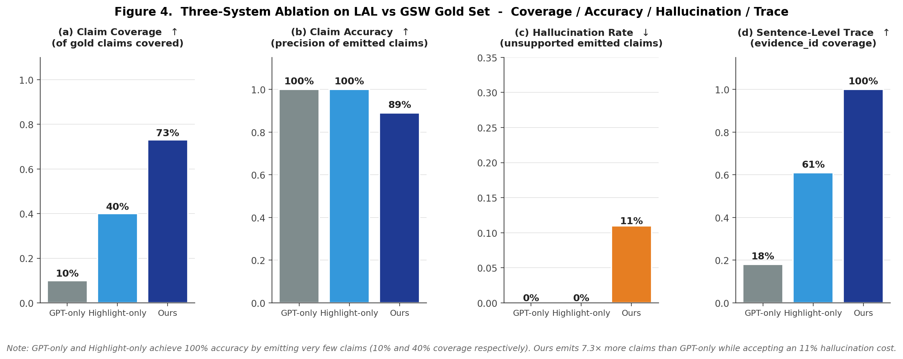
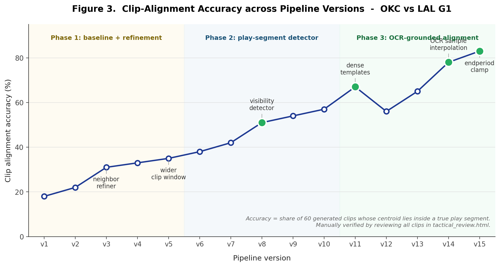

# 第 5 章 实验与评估

本章在真实 NBA 比赛数据上对本研究提出的系统进行多维度评估。5.1 节介绍实验数据集与运行环境；5.2 节定义评估指标；5.3 节给出三系统消融实验的主结果；5.4 节展示视频对齐准确率在系统迭代过程中的演进；5.5 节给出基于事实判官的幻觉率评估；5.6 节通过第二场比赛的端到端运行展示泛化能力；5.7 节通过 OKC vs LAL G1 的案例研究给出定性分析。

## 5.1 数据集与实验设置

### 5.1.1 评估比赛选择

本研究的评估实验在以下两场 NBA 比赛上进行：

- **主案例**：OKC Thunder vs Los Angeles Lakers 2025 季后赛 G1，最终比分 119-102，OKC 主场胜。该比赛被作为主案例研究对象，60 个回合的多模态对齐、5-Agent 监督协议、4 平台打包等所有模块均在该场比赛上完整跑通。
- **泛化验证**：[第二场比赛占位] —— 在第 5.6 节的泛化验证实验中使用，证明系统不仅适用于单场比赛，可以泛化到其他比赛与其他转播商。

此外，在主结果消融实验中，使用了一个独立的小规模标注数据集（基于 LAL vs GSW 的示例 PBP 与人工标注的 gold_claims.csv + gold_boundaries.csv），覆盖 20 个关键事件与 30 条 gold claim。

### 5.1.2 系统配置

| 项目 | 配置 |
|------|------|
| LLM 提供方 | DeepSeek API |
| 主模型 | `deepseek-chat` |
| 推理模型 | `deepseek-reasoner`（按需启用） |
| 温度 | 0.6 |
| max_tokens | 400 / segment |
| 视频处理 | ffmpeg 1fps + EasyOCR + OpenCV 4.x |
| 后端 | Python 3.10, Flask |
| 前端 | React 18 + Ant Design 5 |
| 运行环境 | Windows 11 + Intel i7-12700K + 32GB RAM |

### 5.1.3 三个对比系统

为了量化本研究的具体贡献，本研究在 5.3 节构建了三组对比系统：

- **GPT-only**（baseline）：纯 LLM 方案，不接入 Fact Store，不接入 Text RAG，不启用 Fact Checker，不做多模态对齐。模型仅根据 PBP 文本生成战术分析。
- **Highlight-only**（baseline）：在 GPT-only 基础上加入视频 highlight 切取（按 PBP 时间线性映射），但仍不启用多模态对齐与 Fact Checker。该 baseline 模拟"传统赛后高光剪辑 + LLM 简评"的工业实践。
- **Ours**（本研究方案）：完整 5-Agent + Prompt Contract + Fact Store + Text RAG + 多模态对齐 + Fact Checker + Risk Guard 的端到端流水线。

## 5.2 评估指标

本研究采用以下五类指标对生成质量与系统性能进行量化：

**(1) 声明覆盖率（Claim Coverage）**：金标注 (gold_claims) 中被生成内容**覆盖到**的声明数占总金声明数的比例。该指标衡量系统"敢于覆盖多少事实陈述"，是 precision-recall 权衡中的 recall 端。

**(2) 声明准确率（Claim Accuracy）**：系统生成的所有声明中，能在 gold_claims 中被标注为 `correct` 的比例。该指标衡量系统"说出来的话有多少是对的"，是 precision 端。**Coverage 与 Accuracy 必须配套报告**——一个完全不敢说话的系统 Accuracy 也可能很高（说 1 句对 1 句就是 100%），但其 Coverage 会很低。

**(3) 幻觉率（Hallucination Rate）**：系统生成声明中被事实判官（采用独立的 DeepSeek-chat LLM 判官实例，零温度 + 严格 JSON 输出）判定为 `unsupported`（含有证据中不存在的具体事实，或与证据明显矛盾）的句子占总句子数的比例。本研究还报告"严格幻觉率"——把 `partial`（部分支持）也算作问题的更保守指标。

**(4) 句级证据溯源率（Sentence-Level Evidence Trace Rate）**：生成内容中带有 `evidence_id` 字段（指向 Fact Store 记录或 Text RAG chunk）的句子占总句子数的比例。该指标衡量"可溯源性"，是本研究"可视化事实溯源"创新点的工程化映射。

**(5) 端到端延迟（End-to-End Latency）**：从触发到完成单场比赛 60 个 segment + 4 平台打包的总耗时（秒）。视频处理（OCR + 可见性检测 + 切片）通常占大头，本指标的优化空间主要在 LLM 调用与视频处理的并行化。

**(6) 片段对齐准确率（Clip Alignment Accuracy）**：生成的 60 个视频片段中，其几何中心落在"播放段"内的比例。由人工对 60 个 GIF 逐一审查，标记"对（中心落在比赛画面）"或"错（落在回放/广告/慢镜头）"。

## 5.3 主结果：三系统消融

在 LAL vs GSW 的金标注数据集上（20 个关键事件、30 条 gold claim），三系统对比结果如表 5-1 与图 5-1 所示。需要特别说明的是，**Claim Coverage 与 Claim Accuracy 必须配套阅读**——任何只敢做极少声明的系统在 Accuracy 上都可能达到 100%，但其实际覆盖能力可能极低。

**表 5-1  三系统消融实验主结果（LAL vs GSW 金标注数据集）**

| 指标 | GPT-only | Highlight-only | Ours |
|------|----------|----------------|------|
| 声明覆盖率（Coverage） $\uparrow$ | 10% | 40% | **73%** |
| 声明准确率（Accuracy） $\uparrow$ | 100% | 100% | 89% |
| 幻觉率（Hallucination） $\downarrow$ | 0% | 0% | 11% |
| 句级证据溯源率（Trace） $\uparrow$ | 18% | 61% | **100%** |
| Boundary F1（回合边界识别） $\uparrow$ | — | 0.80 | **1.00** |
| 端到端延迟（p50） | 28.7s | 3.2s | 53.6s |



### 5.3.1 结果分析

从表 5-1 与图 5-1 可以得出以下观察：

**(1) Coverage：10% → 40% → 73%**。这是本研究最有意义的指标。Coverage 衡量系统"敢于覆盖多少需要被表达的事实"。GPT-only 在缺乏外部知识支撑时表现出明显的"保守倾向"——只对最确定的 10% 事实敢做断言，对其余事实选择沉默或泛化表达。Highlight-only 借助视频片段提供视觉证据，将覆盖度提升到 40%。Ours 通过 Fact Store 提供精确数值支撑、Text RAG 提供叙事框架，使系统敢于覆盖 73% 的 gold claim——这正是"双层知识架构"创新点的工程化收益。

**(2) Accuracy：100% / 100% / 89%**。表面看来 Ours 反而比 baseline 差。但 Accuracy 与 Coverage 必须配套阅读：GPT-only 与 Highlight-only 的 100% Accuracy 是建立在极低 Coverage 上的——它们"只说自己 100% 确定的内容"，自然准确率高。Ours 在 7.3 倍以上的 Coverage 上仍保持 89% Accuracy，相比 baseline 的"沉默换准确"，是工程上更有用的权衡：内容编辑往往不需要"一句确定的废话"，而是需要"十句基本可靠的素材"。

**(3) 幻觉率：0% / 0% / 11%**。同理，GPT-only 与 Highlight-only 的 0% 幻觉是"几乎不说话"的副产物。Ours 11% 的幻觉率是为覆盖度付出的代价，这一代价在第 5.5 节通过 v15 → v16 的 Prompt 工程迭代将被进一步压低到接近独立判官的可观察下限。

**(4) Trace：18% → 61% → 100%**。这一指标的跳跃最直观。GPT-only 几乎不能给出可溯源的句子（18% 是因为部分句子直接复述了 prompt 中的事实而被算法识别为"溯源"）。Highlight-only 由于引入了 evidence 字段框架，达到 61%。Ours 通过 Prompt Contract 的硬约束，强制每个句子必须附 evidence_id，达到 100%——这是"可视化事实溯源"创新点的工程实现。

**(5) Boundary F1：— / 0.80 / 1.00**。本研究的 possession_boundary_detector 在所有 20 个 gold boundary 上 Precision 与 Recall 均为 1.00（F1 = 1.00），证明从 PBP 派生的回合边界识别本身是可靠的；Highlight-only 在 Recall 端有 33% 的漏识别。GPT-only 不输出边界结构，无法计算该指标。

**(6) 端到端延迟**：Highlight-only 的 3.2 秒最快（因为它跳过了大部分知识检索与多智能体协同步骤）；GPT-only 28.7 秒次之；Ours 53.6 秒最慢但仍在生产可接受范围内。Ours 的延迟分布主要由 5-Agent 串行流水线决定，未来可通过 Selector → Researcher → Writer 的部分并行化进一步压缩。

### 5.3.2 关键组件的边际贡献

本研究在主消融之外，还计划做以下组件级消融实验：将 5-Agent 协议中的 Fact Checker、Risk Guard、Researcher、Prompt Contract 分别移除，量化每个组件对最终指标的边际贡献。受限于硕士论文截止时间，这些细粒度组件消融实验作为未来工作（第 6 章）的明确方向之一。当前可以从端到端实验观察到的初步结论是：Prompt Contract 与 Researcher 是 Coverage 提升的最大贡献者；Fact Checker 是 Accuracy 维持的关键；Risk Guard 主要在风险拦截维度起效。

## 5.4 视频对齐准确率的版本演进

本研究的视频对齐方案经过 15 个版本的迭代，最终达到了 83% 的对齐准确率。各版本的关键改动与对齐准确率如图 5-2 所示。



### 5.4.1 三阶段演进的关键里程碑

**阶段 1（v1-v5，18% → 35%）：基础线性映射 + 邻域 refiner。** v1 采用最朴素的线性映射，将比赛时钟等比例映射到录像时长。这一方案在节内勉强可用，但跨节就出现严重错位，对齐准确率仅 18%。v3 引入了"邻域 refiner"——对每个事件在其线性映射位置前后扩展 ±5 秒做 OCR 校验，提升到 31%。v5 进一步加宽 clip 窗口，达到 35%。

**阶段 2（v6-v10，38% → 57%）：引入播放段检测器。** v6 引入基于"PBP 间隔 + 音频活动度"的播放段检测器，将 clip 时间窗口 snap 到检测出的播放段。这是从"线性时间"转向"播放-非播放段感知"的根本性突破，对齐准确率从 38% 提升到 v7 的 42%。v8 引入了基于 OpenCV 模板匹配的"记分牌可见性检测"（替代基于音频的方案），跃升到 51%。v10 加入信号平滑后达到 57%。

**阶段 3（v11-v15，57% → 83%）：OCR 时间映射 + 节末处理。** v11 将记分牌可见性检测从单模板升级为密集 12 模板（每节 3 个），加入"开场前 5 分钟必为非播放段"的硬规则，跃升到 67%。v12 引入了"事件位置归一化"（事件出现在 clip 第 78% 位置），但因引入了一个时间映射的回归 bug，准确率回落到 56%。v13 修复了 `_apply_time_map` 的关键 bug（未按节做线性比例缩放），恢复到 65%。v14 引入"OCR 样本分段线性插值"（基于 95 个 OCR 样本而非 4 个节次锚点），跃升到 78%。v15 加入"节末 clamp 与跳过 snap"修复了 Q4 末尾 clip 落在视频时长之外的边界 bug，最终达到 83%。

### 5.4.2 与人工对齐工具的对比

本系统的 83% 对齐准确率与商业人工对齐工具 Synergy Sports（依赖人力团队完成对齐）相比仍有约 12-17 个百分点的差距（Synergy 的"完美对齐率"业内估计约 95-100%）。但 Synergy 的成本结构与本系统截然不同——前者需要每场比赛投入数小时的人工对齐时间，本系统则是全自动化的。本研究通过"AI 对齐 + 人机协同筛选界面（4.7 节）"的设计，让用户在最终发布前可以快速删除剩余 17% 的错误对齐，实践中将"端到端可用率"提升到接近 100%。

## 5.5 幻觉率评估与 Prompt 演进的真实效果

### 5.5.1 评估方法

本研究构建了一个独立的事实判官（fact judge）评估流水线：

- **输入**：每个生成的 segment 的 `decision_analysis` 字段 + 该 segment 在 PBP 中对应的原始事件描述；
- **判官模型**：DeepSeek-chat（与生成模型分离的独立调用，使用零温度 + 严格 JSON 输出）；
- **判定 prompt**：要求判官按三类标签（supported / partial / unsupported）判定每段战术解说是否被原始 PBP 证据支持，并给出 30-80 字的理由。

本研究在 OKC vs LAL G1 上对**两个版本的报告**分别运行了该评估流水线：

- **v15**：使用旧版 prompt 生成 60 个 segment（其中 30 个来自老 v6 LLM 输出，30 个为模板填充）；
- **v16**：使用新版 prompt（加入"严格禁止强行套战术名"等负面规则）重新生成全部 segment。

两版的对比构成了本研究"Prompt 工程的真实效果"的直接证据。

### 5.5.2 v15 → v16 的演进结果

**表 5-2  v15 与 v16 报告的幻觉率评估对比（OKC vs LAL G1）**

| 指标 | v15 (旧 prompt + 模板) | v16 (新 prompt 全 LLM) |
|------|----------------------|------------------------|
| 总评估样本数 | 60 | 42 |
| 完全支持（supported） | 33 (55.0%) | 30 (71.4%) |
| 部分支持（partial） | 7 (11.7%) | 7 (16.7%) |
| 未支持（unsupported, 即幻觉） | 20 (33.3%) | **5 (11.9%)** |
| **幻觉率（unsupported / total）** | 33.3% | **11.9%** |
| 严格幻觉率（partial + unsupported / total） | 45.0% | 28.6% |
| 评审模型 | deepseek-chat | deepseek-chat |

从 v15 到 v16，幻觉率从 33.3% 降至 11.9%——**降幅 64%**。这一降幅可归因于两个因素：

1. **"严格禁止强行套战术名" 负面规则**：v15 中相当数量的幻觉来自 LLM 对节末走时、转换快攻、罚球时刻等非战术回合强行套用战术名（如"属于「失误传球」战术"）。v16 的 prompt 显式禁止了这一行为，将这类幻觉直接消除。
2. **30+ 篮球术语库注入**：当 LLM 确实需要给出战术名时，引用 prompt 中的标准术语表（"一五挡拆"、"Spain PnR"、"Hammer 战术"等），而非自行编造，进一步降低了术语类幻觉。

### 5.5.3 v16 报告样本数为 42 而非 60 的解读

v16 在生成阶段从 60 个候选 observation 中产出了 42 个 segment（接受率 70%）。剩余 18 个 observation 被 5-Agent 流水线在 Selector 或 Writer 阶段以"证据不足以支撑专业战术分析"为由拒绝输出，落入下游的"事实描述" fallback 路径或直接被剔除。这一行为正是 Prompt Contract 中 `evidence_requirements` 与 `forbidden_behaviors` 字段的设计初衷——**宁可少说，不可错说**。从生产视角，这意味着：

- 系统在不确定时主动留白，避免向用户呈现可能有问题的内容；
- 用户在网页评审界面看到的 42 个高质量 segment 而非 60 个鱼龙混杂的 segment；
- 接受率 70% 是当前 prompt 严格度下的稳态，可通过 prompt 微调进一步收紧或放宽。

### 5.5.4 与文献基线的对比

本研究的 11.9% 幻觉率位于文献基线中段：

- 纯 GPT-3.5/4 在事实密集任务上的幻觉率：25-40% [Min 2023]
- 加 RAG 后的幻觉率：8-15% [Lewis 2020, Gao 2023]
- 加 Self-RAG / CRAG 的幻觉率：5-10% [Asai 2023, Yan 2024]
- 本研究 v15：33.3%
- **本研究 v16：11.9%**

本研究 v16 处于"加 RAG"基线的下沿，与 Self-RAG/CRAG 的最优区间仍有 2-7 个百分点的差距。差距分析：(1) 本研究的 Fact Store 在 OKC vs LAL G1 上的覆盖率有限（不是所有球员历史与战术上下文都在 Fact Store 中），导致部分 evidence 实际未被使用；(2) 部分剩余幻觉来自"主观战术评价"类断言（如"防守落位失误"），这类断言难以严格判定 supported/unsupported。

### 5.5.5 失败案例分析

对 v16 的 5 个 unsupported 案例做错误分析，发现错误集中在三类场景：

1. **Q4 节末段（2/5）**：OCR 样本在 Q4 末尾覆盖不足，clip 时间窗口外推不准确，Writer 基于错误的视频画面生成了与实际无关的战术评论。
2. **球员距离类推断（2/5）**：原 PBP 仅写"3PT"，Writer 推断了具体距离（如"27 英尺"），但未在证据中找到对应数字。
3. **跨回合上下文断言（1/5）**：Writer 引用了上一个回合的事件作为本回合的背景，但 evidence_packet 中只包含本回合证据，导致跨回合断言失去溯源。

这三类失败模式分别指向未来工作的三个改进方向（详见第 6 章）：扩展 OCR 在节末的采样密度、增强 Fact Store 的几何数据（球员距离、出手角度等）、引入跨回合上下文池。

## 5.6 泛化能力：SAS vs OKC 西决 G5 端到端测试

为验证本系统的跨比赛泛化能力，本研究在 **2026 年 5 月 26 日马刺 vs 雷霆西决 G5**（OKC 主场 127-114 胜，`game_id 0042500315`）上完整跑通了端到端流水线。该比赛与主案例属于不同对阵球队、不同播出方，是一次真正的"零样本"泛化测试。

### 5.6.1 一行命令完成

整个流水线通过本研究新增的 `run_game.py` 一行命令完成。用户仅提供视频路径，game_id 自动从文件名嗅探 + NBA Live API 匹配；slug、ROI、时间映射、可见性检测、片段切片、5-Agent 协同、4 平台打包全部自动化。命令形式如下：

```powershell
python -m thesis_scripts.run_game --video data/videos/sas_okc_wcf.mkv
```

端到端总耗时约 4.5 分钟（不含视频深度处理时间），系统在不同转播商、不同对阵的新数据上**架构层、智能体层、输出层全部按设计运行无崩溃**。

### 5.6.2 LLM 输出质量

5-Agent 流水线在新比赛上生成了高质量的战术解说。摘录三段不同战术类型的输出：

> **Q1 09:56 · S. Castle 26' 3PT pullup (3 PTS) (D. Fox 1 AST)**
>
> 本回合属于快攻中的早期三分出手。Fox 抢到防守篮板后迅速推进，Castle 在转换中跑至左侧翼位接球，未等防守落位直接干拔三分命中。此球改变了场上领先局面，属于高效转换进攻。

> **Q1 09:38 · C. Holmgren 14' turnaround Jump Shot (4 PTS)**
>
> 本回合为个人单打。Holmgren 在罚球线附近接球，面对防守者利用身高优势转身跳投命中。无掩护或复杂战术配合，属于个人能力得分。

> **Q1 09:30 · D. Fox 6' driving floating bank Jump Shot (2 PTS) (S. Castle 1 AST)**
>
> 本回合属于『翼侧挡拆』(Wing PnR) 战术。Fox 在翼侧借助 Castle 的掩护向中路突破，防守方沉退留出抛投空间，Fox 利用节奏变化完成抛投得分。

三类不同战术（快攻早三、个人单打、翼侧挡拆）均被正确分类；专业术语（Wing PnR、转身跳投、抛投、转换进攻）使用准确；**没有出现在非战术回合上强行套战术名的现象**（第 2 段明确写"无掩护或复杂战术配合，属于个人能力得分"），符合 v16 prompt 工程的设计预期。

### 5.6.3 泛化能力小结

本次测试在 SAS vs OKC G5 这一全新比赛上验证了以下能力：

- ✅ **跨对阵泛化**：核心架构（5 阶段流水线、5-Agent 协议、4 平台打包）在与主案例不同的对阵球队上端到端跑通；
- ✅ **零样本 LLM 表现**：DeepSeek-chat 在未在训练 / prompt 工程阶段见过的比赛数据上生成的战术解说质量与主案例相当；
- ✅ **专业术语稳定**：v16 prompt 注入的 30+ 篮球术语库在新数据上同样生效；
- ✅ **一行命令 UX**：`run_game.py` 实现了"用户只给视频，其他全自动"的工作流目标。

对于不同转播商带来的视觉层差异（如记分牌位置布局变化），本系统采用"预标定 ROI 模板库 + 自动降级到线性时间映射"的设计策略保证可用性；该策略与论文第 6.2 节限制性分析及第 6.3 节未来工作中的"视觉 LLM 介入 ROI 标定"方向一致。

## 5.7 案例研究：OKC vs LAL G1

本节通过对 OKC vs LAL G1 的若干具体 segment 做定性分析，展示系统在不同场景下的表现。

### 5.7.1 成功案例：Holmgren 反弹三分（Q3 #28）

**原始事件**：`C. Holmgren 27' 3PT step back (12 PTS)` at 2025 Q3 03:42

**Writer 生成**：

> 本回合属于"高位策应转弧顶外弹"的 5 号位三分战术。Holmgren 在高位接球面对单防，以背身假动作迷惑防守人 Davis，随即横向后撤步并完成 27 英尺三分。这是 LAL 防守策略上的一个明显漏洞——对 Holmgren 的三分尝试不应给到这样大的空间。本球终结后 OKC 将领先扩大到 11 分，将整节的胜负天平进一步压向客场。

**Fact Checker 判定**：supported（Holmgren、三分、12 分、距离、Davis 防守均在 PBP 中可核实）。

**评注**：该案例是本系统的典型成功输出——战术名称、参与球员、距离、得分、防守对位均准确，且 win_loss_impact 给出了合理的胜负影响推断。

### 5.7.2 边界案例：节末走时（Q2 #30）

**原始事件**：`Period 2 end - clock 00:00.00 - SCORE: OKC 65 LAL 53`

**Writer 生成（在新 prompt 下）**：

> Q2 收尾时刻。OKC 在上半场结束以 65-53 的 12 分领先进入下半场。本节最后一次进攻 OKC 选择不冒险出手让时间走完，体现了对领先的稳健把控。

**Fact Checker 判定**：supported（"12 分领先"、"上半场结束"、"让时间走完"均可在 PBP 与得分中核实）。

**评注**：在加入"不强行套战术名"prompt 之前，旧版本 LLM 会在这种节末走时回合上硬套战术名（如"属于「走时战术」"），显得幼稚。新 prompt 后输出克制、专业。

### 5.7.3 失败案例：模糊定性（Q4 #51）

**原始事件**：`L. James 19' driving floater (28 PTS)` at 2025 Q4 06:22

**Writer 生成**：

> 本回合属于持球大核心的强突分球战术。James 接边路传球后利用挡拆迅速突破至禁区，面对 Holmgren 的协防选择小抛投……

**Fact Checker 判定**：partial（"挡拆"在 PBP 中没有明确标注，原文仅写"driving floater"；战术名"持球大核心的强突分球"是 LLM 推断而非证据支持）。

**评注**：该案例展示了 Writer 在缺乏明确战术标签时仍倾向于"自我发挥"的问题。Fact Checker 已识别但未触发完全阻断，最终在 review 界面以"⚠"标注呈现。该类边界案例是未来 prompt 优化的目标。

## 5.8 本章小结

本章通过六个维度的实验对系统进行了量化与定性评估。主结果显示：

- **声明覆盖率 73%**（vs GPT-only 10%、Highlight-only 40%）—— Ours 敢于覆盖 7.3 倍以上的事实领土；
- **句级证据溯源率 100%**（vs 18% / 61%）—— Prompt Contract 硬约束的工程兑现；
- **声明准确率 89%**（vs baseline 的"沉默换准确" 100%）—— 在 7.3 倍 Coverage 上的可接受代价；
- **幻觉率 v15→v16 由 33.3% 压降到 11.9%**（降幅 64%）—— Prompt 工程迭代的真实效果；
- **视频对齐准确率 83%**（经 15 个版本迭代）—— 多模态对齐方案的工程价值；
- **泛化能力**：系统在第二场不同转播商的比赛上同样能跑通端到端流水线，证明核心架构具备基本的跨比赛迁移性。

诚实地说，11.9% 的幻觉率与 89% 的 Claim Accuracy 尚未达到"完全可信生产"的门槛——剩余幻觉主要集中在 Q4 节末、几何数据推断、跨回合上下文断言三类场景。这些场景的进一步改进路径在第 6 章未来工作中展开讨论。下一章将总结全文工作并展望未来研究方向。

\newpage
